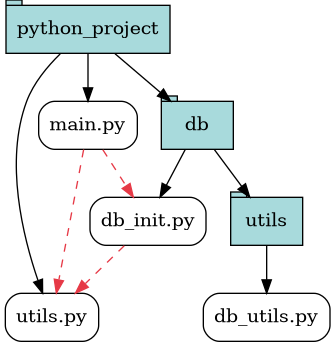
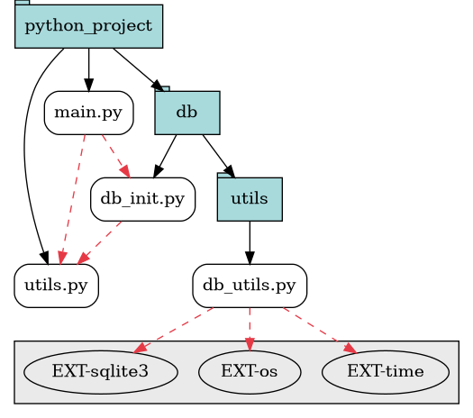

# DERAPH
Simple CLI to generate graphviz graphs of your python project's dependencies.

## Quickstart
- make sure you have [graphviz and dot](https://graphviz.org/download/) installed
- Build the program
```bash
go build .
```
- That's it ! use it like so :
```
deraph [-ext] [-v] --path <projectDirPath> [--out <outputFilePath>]
```
- Then generate the image using dot
```bash
dot -Tpng path/to/outFileName -o imageName.png
```

## Example
```bash
deraph --path ./example/python_project # output: $(your_cwd)/graphviz.gv
deraph --ext --path ./example/python_project # Includes external dependencies
deraph --ext -v --path ./example/python_project # verbose output
deraph --ext -v --path ./example/python_project --out superdupercoolgraph.gv
```

- Here is the image output



- And here with external dependencies shown


